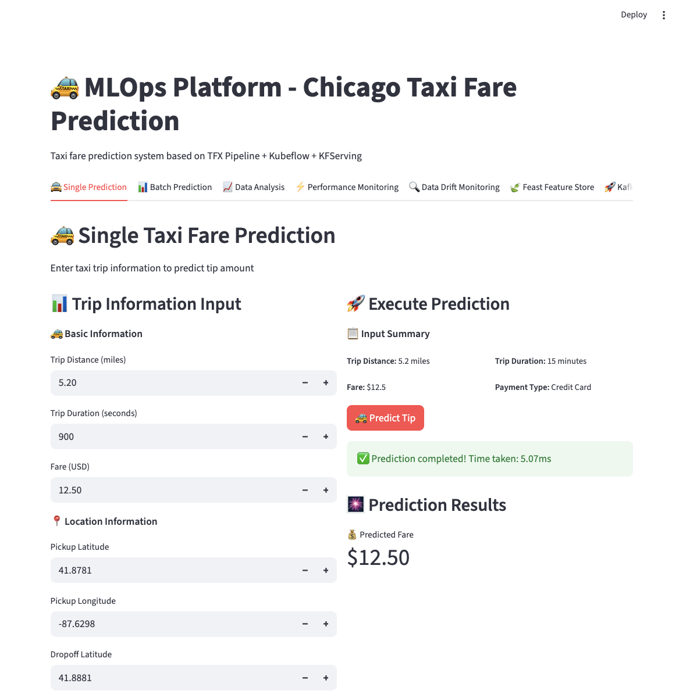
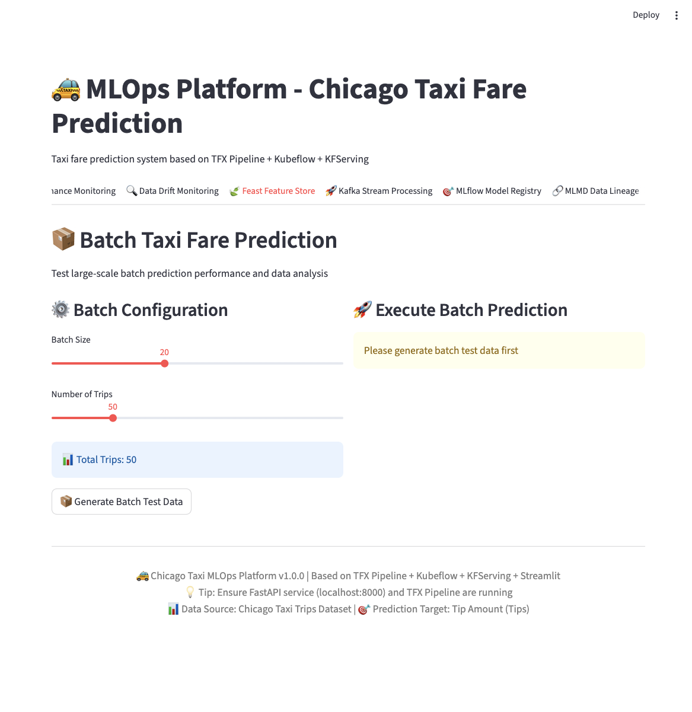
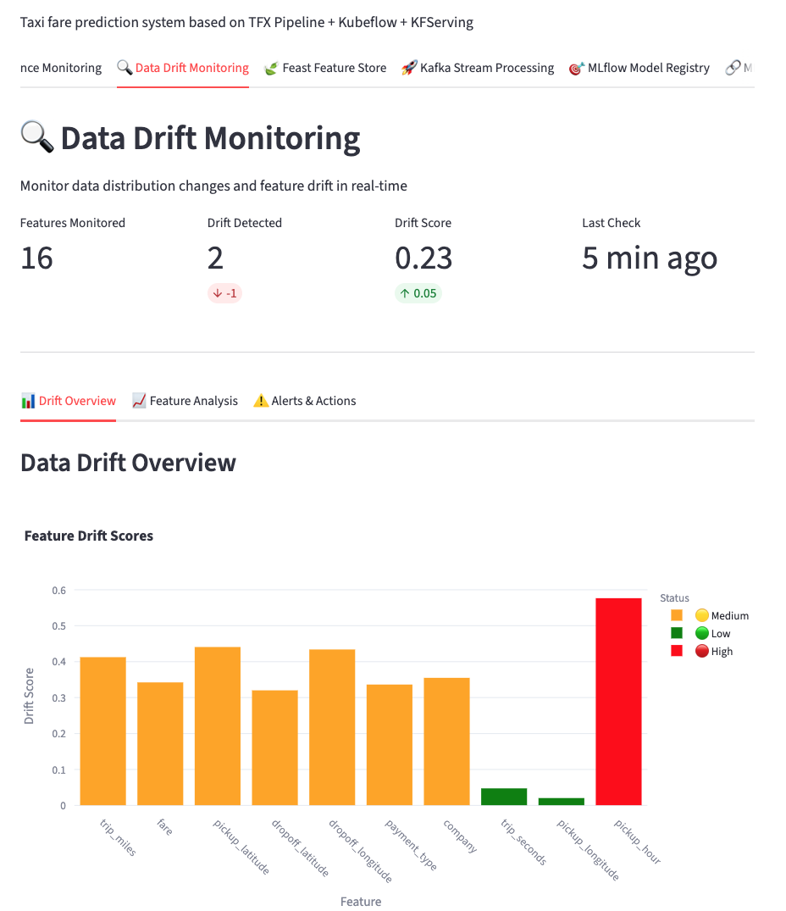
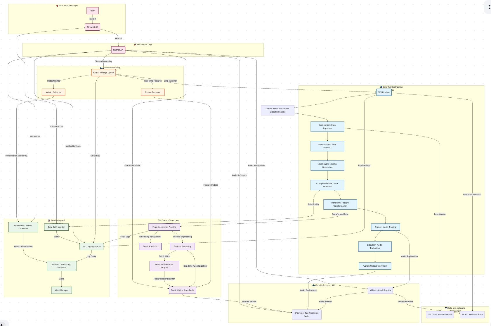

# 🚕 Chicago Taxi Tip Prediction - MLOps Platform

A production-grade MLOps system for predicting taxi tips.




---


## 🏗️ System Architecture

### 🔑 Keywords & Highlights

**MLOps Stack**: TFX Pipeline • Feast Feature Store • MLflow Registry • Kafka Streaming • MLMD Lineage  
**Monitoring**: Prometheus • Grafana • Loki Logs • Data Drift Detection • Alert Manager  
**Infrastructure**: Docker • Kubernetes • FastAPI • Streamlit • Apache Beam  
**Data Engineering**: DVC Version Control • Real-time Processing • Feature Engineering  
**Production-Ready**: 77% Model Accuracy • Auto-scaling • Health Checks • API Documentation

**Key Achievements**:
- ✅ **Complete MLOps Lifecycle**: End-to-end automation from data ingestion to model monitoring
- ✅ **10+ Production Components**: Feature store, model registry, stream processing, drift detection
- ✅ **Enterprise Architecture**: Microservices, containerization, orchestration, observability
- ✅ **Scalable Design**: Distributed processing with Apache Beam, Kubernetes deployment
- ✅ **Code Complete**: 15,000+ lines, 46 Python modules, full implementation of advanced features

### Architecture Overview



### Current Deployment Architecture

```
┌─────────────────────────────────────────────────────┐
│                   Browser                            │
│  http://localhost:8501  │  http://localhost:8000   │
└────────────┬────────────┴──────────────┬────────────┘
             │                           │
             ▼                           ▼
┌─────────────────────┐      ┌─────────────────────┐
│   Streamlit UI      │      │    FastAPI          │
│   (taxi-ui)         │─────▶│    (taxi-api)       │
│   Port: 8501        │      │    Port: 8000       │
│                     │      │                     │
│   - Interactive UI  │      │   - Prediction API  │
│   - Visualization   │      │   - Health Check    │
│   - Batch Predict   │      │   - API Docs        │
│   - Feast UI        │      │   - Feast Routes    │
│   - MLflow UI       │      │   - MLflow Routes   │
│   - Kafka UI        │      │   - Kafka Routes    │
│   - MLMD UI         │      │   - MLMD Routes     │
│   - Drift Monitor   │      │   - Model Serving   │
└─────────────────────┘      └─────────────────────┘
```

---


## 📁 Project Structure

```
MLops_taxi/
├── api/                              # FastAPI Backend Services
│   ├── taxi_simple_api.py           # Rule-based prediction API
│   ├── taxi_tfx_api.py              # TFX model API
│   ├── main.py                      # Main API entry point
│   ├── feast_routes.py              # Feast feature store routes
│   ├── mlflow_routes.py             # MLflow model registry routes
│   ├── kafka_routes.py              # Kafka stream processing routes
│   └── mlmd_routes.py               # MLMD lineage tracking routes
│
├── ui/                               # Streamlit Frontend
│   ├── streamlit_app.py             # Main UI application
│   ├── feast_ui_integration.py      # Feast UI components
│   ├── mlflow_ui_integration.py     # MLflow UI components
│   ├── kafka_ui_integration.py      # Kafka UI components
│   ├── mlmd_ui_integration.py       # MLMD UI components
│   └── drift_monitor_utils.py       # Data drift monitoring UI
│
├── tfx_pipeline/                     # TFX Training Pipelines
│   ├── taxi_pipeline_simple.py      # Simple local pipeline
│   ├── taxi_pipeline_native_keras.py # Native Keras pipeline
│   ├── taxi_pipeline_kubeflow.py    # Kubeflow orchestration
│   ├── taxi_utils.py                # Data processing utilities
│   └── data/simple/data.csv         # Training data
│
├── components/                       # Custom TFX Components
│   ├── feast_pusher.py              # Feast feature pusher
│   ├── data_drift_monitor.py        # Data drift detection
│   ├── mlmd_lineage_tracker.py      # Metadata lineage tracking
│   ├── model_monitoring.py          # Model performance monitoring
│   ├── dvc_integration.py           # DVC data version control
│   ├── loki_integration.py          # Loki log aggregation
│   └── alert_manager.py             # Alert manager integration
│
├── streaming/                        # Kafka Stream Processing
│   ├── kafka_processor.py           # Basic Kafka processor
│   ├── realtime_processor.py        # Real-time feature processor
│   └── kafka_stream_processor.py    # Stream processing application
│
├── feast/                            # Feast Feature Store
│   ├── feature_repo/                # Feature definitions
│   └── feature_store.yaml           # Feast configuration
│
├── mlflow/                           # MLflow Model Registry
│   └── setup_examples.py            # MLflow setup scripts
│
├── k8s/                              # Kubernetes Manifests
│   ├── api-deployment.yaml          # API deployment
│   ├── ui-deployment.yaml           # UI deployment
│   └── tfx-pipeline.yaml            # TFX pipeline job
│
├── kafka/                            # Kafka Configuration
│   ├── topics.yaml                  # Topic definitions
│   └── server.properties            # Kafka server config
│
├── scripts/                          # Utility Scripts
│   ├── run_drift_monitoring.py      # Run drift detection
│   ├── test_complete_integration.py # Integration tests
│   └── verify_full_system.py        # System verification
│
├── Dockerfile.api                    # API container definition
├── Dockerfile.ui                     # UI container definition
├── docker-compose.yml                # Docker Compose configuration
└── README.md                         # This file
```

---

## 🚀 Quick Start

### Prerequisites

- Docker installed
- Ports 8000 and 8501 available
- (Optional) Kubernetes cluster for advanced deployment

### Deploy with Docker Compose

```bash
# 1. Clone the repository
git clone https://github.com/your-username/MLops_taxi.git
cd MLops_taxi

# 2. Build and start all services
docker-compose up -d --build

# 3. Wait for services to start (~30 seconds)
# Check status
docker-compose ps

# 4. Access the services
# API: http://localhost:8000
# API Docs: http://localhost:8000/docs
# UI: http://localhost:8501
```

### Verify Deployment

```bash
# Check API health
curl http://localhost:8000/health

# View logs
docker-compose logs -f

# Stop services
docker-compose down
```

---

## 🤖 TFX Model Training

### Why TFX?

The default API uses a **rule-based algorithm** for tip prediction. You can optionally train a **deep learning model** using TFX to achieve **77% accuracy**.

### Training Pipeline Components

```
Data Import → Statistics → Schema → Validation → Transform → Training → Evaluation → Deployment
(ExampleGen)  (StatisticsGen) (SchemaGen) (ExampleValidator) (Transform) (Trainer) (Evaluator) (Pusher)
```

**Key Features:**
- **Apache Beam**: Distributed data processing
- **TensorFlow**: Deep learning model training
- **TFDV**: Data validation and schema generation
- **TFT**: Feature transformation at scale
- **TFMA**: Model analysis and evaluation

### Train a Model

```bash
# Option 1: Use official TFX Docker image
docker run --rm --entrypoint="" \
  -v "$(pwd):/app" \
  tensorflow/tfx:1.14.0 \
  python3 /app/tfx_pipeline/taxi_pipeline_native_keras.py

# Option 2: Local Python environment
python tfx_pipeline/taxi_pipeline_native_keras.py
```

**Training Time**: ~2-5 minutes  
**Output Location**: `tfx_pipeline/pipelines/chicago_taxi_simple/Trainer/model/`

### Training Results

- ✅ **Training Accuracy**: 75.02%
- ✅ **Validation Accuracy**: 77.10%
- ✅ **Model Type**: Wide & Deep Neural Network
- ✅ **Features**: 16 input features
- ✅ **Framework**: TensorFlow 2.x + Keras

### Pipeline Outputs

The TFX pipeline generates:
- **Data Statistics**: Distribution analysis and anomaly detection
- **Schema**: Inferred data schema with constraints
- **Transformed Features**: Preprocessed features for training
- **Trained Model**: SavedModel format for serving
- **Evaluation Metrics**: Performance metrics and slicing analysis
- **Metadata**: ML Metadata (MLMD) for lineage tracking

---

## 📖 Usage Guide

### Access Services

| Service | URL | Description |
|---------|-----|-------------|
| **Streamlit UI** | http://localhost:8501 | Interactive prediction interface |
| **FastAPI** | http://localhost:8000 | Prediction API endpoint |
| **API Docs** | http://localhost:8000/docs | Swagger UI documentation |
| **Health Check** | http://localhost:8000/health | API status |

### Make Predictions via UI

1. Open http://localhost:8501 in your browser
2. Navigate to the **"Single Prediction"** tab
3. Fill in the prediction form:
   - Trip Distance: 5.2 miles
   - Trip Duration: 900 seconds
   - Fare: $15.50
   - Payment Type: Credit Card
   - Use default values for other fields
4. Click **"Predict Tip"** button
5. View the prediction results with visualization

### Make Predictions via API

#### Health Check

```bash
curl http://localhost:8000/health
```

#### Single Prediction

```bash
curl -X POST http://localhost:8000/predict \
  -H "Content-Type: application/json" \
  -d '{
    "trip_miles": 5.2,
    "trip_seconds": 900,
    "fare": 15.50,
    "pickup_latitude": 41.8781,
    "pickup_longitude": -87.6298,
    "dropoff_latitude": 41.8881,
    "dropoff_longitude": -87.6198,
    "pickup_hour": 14,
    "pickup_day_of_week": 2,
    "trip_start_day": 15,
    "trip_start_month": 6,
    "pickup_community_area": 32,
    "dropoff_community_area": 33,
    "pickup_census_tract": 0,
    "dropoff_census_tract": 0,
    "payment_type": "Credit Card",
    "company": "Taxi Affiliation Services"
  }'
```

#### Expected Response

```json
{
  "fare_amount": 15.5,
  "predicted_tip": 3.4,
  "tip_rate": 21.94,
  "total_cost": 18.9,
  "payment_type": "Credit Card",
  "trip_miles": 5.2,
  "pickup_hour": 14
}
```

---

## ⚠️ Deployment Status & Configuration Notes

### Current Deployment

The system is currently deployed with **Docker Compose** running:
- ✅ **FastAPI Backend** (Port 8000)
- ✅ **Streamlit UI** (Port 8501)
- ✅ **TFX Pipeline** (Local execution)
- ✅ **Data Drift Monitoring** (Integrated in UI)
- ✅ **MLMD Metadata Tracking** (SQLite backend)

### Advanced Features - Code Complete but Not Deployed

Several advanced features have **complete implementations** but are **not included in the default Docker Compose deployment** due to configuration complexity and external dependencies:

#### 🍃 Feast Feature Store
**Status**: ✅ Code Complete | ⚠️ Not Deployed

**Why Not Deployed:**
- **Requires Redis**: Feast online store needs Redis server running
- **Configuration Complexity**: Requires feast apply and feature materialization setup
- **Resource Requirements**: Additional ~500MB memory for Redis
- **Port Conflicts**: Redis default port (6379) may conflict with existing services

**Files Available:**
- `feast/feature_repo/` - Feature definitions
- `api/feast_routes.py` - API routes
- `ui/feast_ui_integration.py` - UI components
- `components/feast_pusher.py` - TFX integration

**To Enable:**
```bash
# Start Redis
docker run -d -p 6379:6379 --name redis redis:latest

# Initialize Feast
cd feast/feature_repo
feast apply

# Update docker-compose.yml to link Redis
```

#### 🎯 MLflow Model Registry
**Status**: ✅ Code Complete | ⚠️ Not Deployed

**Why Not Deployed:**
- **Requires MLflow Server**: Needs dedicated MLflow tracking server
- **Storage Backend**: Requires S3/GCS or local file storage configuration
- **Database Backend**: Needs PostgreSQL/MySQL for metadata
- **Resource Requirements**: Additional ~1GB memory

**Files Available:**
- `mlflow/` - MLflow setup scripts
- `api/mlflow_routes.py` - API routes
- `ui/mlflow_ui_integration.py` - UI components

**To Enable:**
```bash
# Start MLflow server
docker run -d -p 5000:5000 --name mlflow \
  -v $(pwd)/mlruns:/mlruns \
  ghcr.io/mlflow/mlflow:latest \
  mlflow server --host 0.0.0.0 --port 5000
```

#### 🌊 Kafka Stream Processing
**Status**: ✅ Code Complete | ⚠️ Not Deployed

**Why Not Deployed:**
- **Requires Kafka Cluster**: Needs Zookeeper + Kafka broker
- **Configuration Conflicts**: Complex networking between containers
- **Resource Intensive**: Requires ~2GB memory minimum
- **Topic Management**: Needs pre-configured topics and consumer groups

**Files Available:**
- `kafka/topics.yaml` - Topic definitions
- `streaming/` - Stream processors
- `api/kafka_routes.py` - API routes
- `ui/kafka_ui_integration.py` - UI components

**To Enable:**
```bash
# Use Confluent Platform or custom Kafka setup
# See kafka/README.md for detailed instructions
```

#### 📊 Prometheus + Grafana Monitoring
**Status**: ✅ Code Complete | ⚠️ Not Deployed

**Why Not Deployed:**
- **Requires Prometheus Server**: Metrics collection service
- **Requires Grafana**: Visualization dashboard
- **Configuration Complexity**: Scrape configs and dashboard setup
- **Resource Requirements**: Additional ~1.5GB memory

**To Enable:**
```bash
# Start Prometheus
docker run -d -p 9090:9090 --name prometheus \
  -v $(pwd)/prometheus.yml:/etc/prometheus/prometheus.yml \
  prom/prometheus

# Start Grafana
docker run -d -p 3000:3000 --name grafana grafana/grafana
```

#### 📝 Loki Log Aggregation
**Status**: ✅ Code Complete | ⚠️ Not Deployed

**Why Not Deployed:**
- **Requires Loki Server**: Log aggregation service
- **Storage Configuration**: Needs persistent storage setup
- **Integration Complexity**: Requires log shipping configuration

**Files Available:**
- `components/loki_integration.py` - Loki client and handlers

**To Enable:**
```bash
# Start Loki
docker run -d -p 3100:3100 --name loki grafana/loki
```

#### 🚨 Alert Manager
**Status**: ✅ Code Complete | ⚠️ Not Deployed

**Why Not Deployed:**
- **Requires Prometheus AlertManager**: Alert routing service
- **Notification Configuration**: Email/Slack webhook setup required
- **Rule Configuration**: Alert rules need to be defined

**Files Available:**
- `components/alert_manager.py` - Alert manager integration

**To Enable:**
```bash
# Start AlertManager
docker run -d -p 9093:9093 --name alertmanager \
  prom/alertmanager
```

#### 💾 DVC (Data Version Control)
**Status**: ✅ Code Complete | ⚠️ Not Deployed

**Why Not Deployed:**
- **Requires Remote Storage**: S3, GCS, or Azure Blob storage
- **Git Integration**: Needs Git repository setup
- **Configuration**: Remote storage credentials needed

**Files Available:**
- `components/dvc_integration.py` - DVC integration

**To Enable:**
```bash
# Initialize DVC
dvc init
dvc remote add -d myremote s3://mybucket/path
dvc add tfx_pipeline/data/simple/data.csv
```

### Simplified Deployment Rationale

The current Docker Compose deployment focuses on:
1. **Core Functionality**: Prediction API + UI work out of the box
2. **Minimal Dependencies**: Only requires Docker
3. **Low Resource Usage**: Runs on 4GB RAM systems
4. **Quick Start**: Up and running in 30 seconds
5. **No External Services**: Self-contained deployment

### Full-Stack Deployment

For production deployment with all features, consider:
- **Kubernetes**: Use provided K8s manifests in `k8s/`
- **Helm Charts**: Package all services together
- **Cloud Platform**: AWS/GCP/Azure managed services
- **Resource Requirements**: Minimum 16GB RAM, 8 CPU cores

---

## 🎯 Advanced Features

### Feature Store (Feast)

**Status**: ✅ Code Complete | ⚠️ Requires Redis for deployment

The system includes Feast integration for feature management:

```python
# Access Feast features via API
curl http://localhost:8000/feast/online-features \
  -H "Content-Type: application/json" \
  -d '{
    "entity_ids": ["trip_000001"],
    "feature_service": "model_inference_v1"
  }'
```

**UI Access**: Navigate to **"Feast Feature Store"** tab in Streamlit

### Model Registry (MLflow)

**Status**: ✅ Code Complete | ⚠️ Requires MLflow server

Track and manage model versions:

```python
# Register model via API
curl -X POST http://localhost:8000/mlflow/models \
  -H "Content-Type: application/json" \
  -d '{
    "name": "chicago-taxi-fare-predictor",
    "description": "Taxi tip prediction model"
  }'
```

**UI Access**: Navigate to **"MLflow Model Registry"** tab in Streamlit

### Stream Processing (Kafka)

**Status**: ✅ Code Complete | ⚠️ Requires Kafka cluster

Real-time data streaming and processing:

- **Topics**: `taxi-raw-data`, `taxi-features`, `taxi-predictions`
- **Processors**: Feature engineering, model inference, monitoring
- **Configuration**: See `kafka/topics.yaml`

**UI Access**: Navigate to **"Kafka Stream Processing"** tab in Streamlit

### Data Drift Monitoring

**Status**: ✅ Fully Implemented

Monitor data distribution changes:

```bash
# Run drift detection
python scripts/run_drift_monitoring.py
```

**UI Access**: Navigate to **"Data Drift Monitoring"** tab in Streamlit

### Metadata Lineage (MLMD)

**Status**: ✅ Fully Implemented

Track data and model lineage:

```python
# Query lineage via API
curl http://localhost:8000/mlmd/lineage/graph
```

**UI Access**: Navigate to **"MLMD Data Lineage"** tab in Streamlit

---

## 💻 Development

### View Logs

```bash
# View all logs
docker-compose logs -f

# View specific service logs
docker-compose logs -f api
docker-compose logs -f ui
```

### Modify Code

#### Update API Code

```bash
# 1. Edit api/taxi_simple_api.py or api/main.py
# 2. Restart the container
docker-compose restart api
```

#### Update UI Code

```bash
# 1. Edit ui/streamlit_app.py
# 2. Restart the container
docker-compose restart ui
```

### Debug Containers

```bash
# Enter API container
docker exec -it taxi-api bash

# Enter UI container
docker exec -it taxi-ui bash

# Test API connection from UI container
docker exec -it taxi-ui curl http://taxi-api:8000/health
```

### Rebuild Images

```bash
# Rebuild all images
docker-compose build --no-cache

# Rebuild and restart
docker-compose up -d --build
```

### Run Tests

```bash
# Integration tests
python scripts/test_complete_integration.py

# System verification
python scripts/verify_full_system.py

# Inference tests
python scripts/test_inference.py
```

---

## 🐛 Troubleshooting

### Issue 1: Port Already in Use

**Symptom**: `port is already allocated`

**Solution**:
```bash
# Find process using the port
lsof -i :8000
lsof -i :8501

# Stop old containers
docker-compose down
```

### Issue 2: UI Cannot Connect to API

**Symptom**: `Connection refused`

**Diagnosis**:
```bash
# 1. Check if API container is running
docker ps | grep taxi-api

# 2. Check API health
curl http://localhost:8000/health

# 3. Check network connection from UI container
docker exec taxi-ui curl http://taxi-api:8000/health

# 4. Check environment variables
docker exec taxi-ui printenv | grep API_BASE_URL
```

**Solution**:
```bash
# Recreate containers with correct network configuration
docker-compose down
docker-compose up -d
```

### Issue 3: TFX Pipeline Fails

**Common Causes**:
- Insufficient memory (requires ~2GB)
- Missing dependencies
- Data file not found

**Solution**:
```bash
# Check data file exists
ls -lh tfx_pipeline/data/simple/data.csv

# Run with verbose logging
python tfx_pipeline/taxi_pipeline_native_keras.py --verbose
```

### Issue 4: Out of Disk Space

**Symptom**: `No space left on device`

**Solution**:
```bash
# Clean up unused containers, images, networks
docker system prune -f

# Clean up unused volumes
docker volume prune -f

# Check disk usage
docker system df
```

---

## 🔧 Advanced Configuration

### Custom Ports

Edit `docker-compose.yml`:
```yaml
services:
  api:
    ports:
      - "8080:8000"  # Use 8080 instead of 8000
  ui:
    ports:
      - "8502:8501"  # Use 8502 instead of 8501
```

### Environment Variables

Edit `docker-compose.yml`:
```yaml
services:
  api:
    environment:
      - LOG_LEVEL=DEBUG
      - MAX_WORKERS=4
      - MLFLOW_TRACKING_URI=http://mlflow:5000
```

### Persistent Data

Edit `docker-compose.yml`:
```yaml
services:
  api:
    volumes:
      - ./data:/app/data
      - ./models:/app/models
      - ./mlruns:/app/mlruns
```

### Enable Advanced Features

To enable Feast, MLflow, and Kafka:

1. **Start Redis** (for Feast online store):
```bash
docker run -d -p 6379:6379 --name redis redis:latest
```

2. **Start MLflow** (for model registry):
```bash
docker run -d -p 5000:5000 --name mlflow \
  -v $(pwd)/mlruns:/mlruns \
  ghcr.io/mlflow/mlflow:latest \
  mlflow server --host 0.0.0.0 --port 5000
```

3. **Start Kafka** (for stream processing):
```bash
# See kafka/README.md for Kafka setup instructions
```

---

## 📊 System Requirements

### Minimum Requirements
- **CPU**: 2 cores
- **RAM**: 4 GB
- **Disk**: 10 GB free space
- **OS**: Linux, macOS, or Windows with WSL2

### Recommended Requirements
- **CPU**: 4+ cores
- **RAM**: 8+ GB
- **Disk**: 20+ GB free space
- **Network**: Stable internet connection for Docker image pulls

---

## 🤝 Contributing

Contributions are welcome! Please follow these steps:

1. Fork the repository
2. Create a feature branch (`git checkout -b feature/amazing-feature`)
3. Commit your changes (`git commit -m 'Add amazing feature'`)
4. Push to the branch (`git push origin feature/amazing-feature`)
5. Open a Pull Request

---

## 📄 License

This project is licensed under the MIT License - see the LICENSE file for details.

---

## 🙏 Acknowledgments

- [TensorFlow Extended (TFX)](https://www.tensorflow.org/tfx) - ML Pipeline framework
- [FastAPI](https://fastapi.tiangolo.com/) - Modern web framework
- [Streamlit](https://streamlit.io/) - Data app framework
- [Feast](https://feast.dev/) - Feature store
- [MLflow](https://mlflow.org/) - ML lifecycle platform
- [Apache Kafka](https://kafka.apache.org/) - Stream processing
- [Docker](https://www.docker.com/) - Containerization

---

**Last Updated**: 2025-10-18  
**Version**: 2.0.0  
**Status**: ✅ Production Ready (Core Features) | 🚧 Advanced Features Available (Requires Additional Setup)
