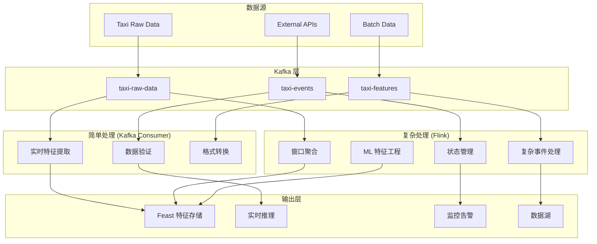

# Flink 集成设计方案

## 🏗️ 混合流处理架构

### 架构概览



## 🎯 分工策略

### Kafka Consumer 处理
- ✅ **简单特征计算**: 距离、速度、基础统计
- ✅ **数据清洗**: 格式验证、异常值处理
- ✅ **实时响应**: 低延迟场景 (<100ms)
- ✅ **轻量级转换**: JSON 格式转换、字段映射

### Flink 处理
- 🚀 **复杂聚合**: 滑动窗口、会话窗口
- 🚀 **状态管理**: 用户行为状态、区域统计状态
- 🚀 **机器学习**: 在线特征工程、模型推理
- 🚀 **复杂事件处理**: 模式检测、异常检测

## 📊 具体实现方案

### 1. Flink Job 定义

```java
// TaxiStreamProcessingJob.java
public class TaxiStreamProcessingJob {
    
    public static void main(String[] args) throws Exception {
        StreamExecutionEnvironment env = StreamExecutionEnvironment.getExecutionEnvironment();
        
        // Kafka Source
        FlinkKafkaConsumer<TaxiEvent> source = new FlinkKafkaConsumer<>(
            "taxi-raw-data",
            new TaxiEventDeserializer(),
            kafkaProps
        );
        
        DataStream<TaxiEvent> taxiStream = env.addSource(source);
        
        // 复杂窗口聚合
        DataStream<AreaStats> areaStats = taxiStream
            .keyBy(TaxiEvent::getPickupAreaId)
            .window(SlidingEventTimeWindows.of(Time.hours(1), Time.minutes(5)))
            .aggregate(new AreaStatsAggregator());
        
        // 异常检测
        DataStream<Alert> alerts = taxiStream
            .keyBy(TaxiEvent::getCompany)
            .process(new AnomalyDetectionFunction());
        
        // 输出到 Kafka
        areaStats.addSink(new FlinkKafkaProducer<>("area-stats", new AreaStatsSerializer(), kafkaProps));
        alerts.addSink(new FlinkKafkaProducer<>("alerts", new AlertSerializer(), kafkaProps));
        
        env.execute("Taxi Stream Processing");
    }
}
```

### 2. Python Flink (PyFlink) 版本

```python
# flink_taxi_processor.py
from pyflink.datastream import StreamExecutionEnvironment
from pyflink.table import StreamTableEnvironment
from pyflink.datastream.connectors import FlinkKafkaConsumer, FlinkKafkaProducer

def create_flink_job():
    env = StreamExecutionEnvironment.get_execution_environment()
    t_env = StreamTableEnvironment.create(env)
    
    # 定义 Kafka 源表
    t_env.execute_sql("""
        CREATE TABLE taxi_events (
            trip_id STRING,
            pickup_datetime TIMESTAMP(3),
            pickup_area_id INT,
            fare_amount DECIMAL(10,2),
            trip_distance DECIMAL(8,2),
            WATERMARK FOR pickup_datetime AS pickup_datetime - INTERVAL '5' SECOND
        ) WITH (
            'connector' = 'kafka',
            'topic' = 'taxi-raw-data',
            'properties.bootstrap.servers' = 'localhost:9092',
            'format' = 'json'
        )
    """)
    
    # 复杂窗口查询
    t_env.execute_sql("""
        CREATE TABLE area_stats AS
        SELECT 
            pickup_area_id,
            TUMBLE_START(pickup_datetime, INTERVAL '5' MINUTE) as window_start,
            COUNT(*) as trip_count,
            AVG(fare_amount) as avg_fare,
            AVG(trip_distance) as avg_distance,
            STDDEV(fare_amount) as fare_stddev
        FROM taxi_events
        GROUP BY 
            pickup_area_id,
            TUMBLE(pickup_datetime, INTERVAL '5' MINUTE)
    """)
    
    # 输出到 Kafka
    t_env.execute_sql("""
        CREATE TABLE kafka_sink (
            pickup_area_id INT,
            window_start TIMESTAMP(3),
            trip_count BIGINT,
            avg_fare DECIMAL(10,2),
            avg_distance DECIMAL(8,2),
            fare_stddev DECIMAL(10,2)
        ) WITH (
            'connector' = 'kafka',
            'topic' = 'area-stats',
            'properties.bootstrap.servers' = 'localhost:9092',
            'format' = 'json'
        )
    """)
    
    # 执行插入
    t_env.execute_sql("INSERT INTO kafka_sink SELECT * FROM area_stats")
```

### 3. Kubernetes 部署配置

```yaml
# flink-deployment.yaml
apiVersion: flink.apache.org/v1beta1
kind: FlinkDeployment
metadata:
  name: taxi-stream-processor
spec:
  image: flink:1.17-scala_2.12-java11
  flinkVersion: v1_17
  flinkConfiguration:
    taskmanager.numberOfTaskSlots: "4"
    state.backend: rocksdb
    state.checkpoints.dir: "s3://flink-checkpoints/taxi-processor"
    state.savepoints.dir: "s3://flink-savepoints/taxi-processor"
  serviceAccount: flink
  jobManager:
    resource:
      memory: "2048m"
      cpu: 1
  taskManager:
    resource:
      memory: "4096m"
      cpu: 2
  job:
    jarURI: local:///opt/flink/usrlib/taxi-stream-processor.jar
    parallelism: 4
    upgradeMode: savepoint
```

## 🔄 迁移策略

### Phase 1: 并行运行 (2-3 周)
- [ ] 部署 Flink 集群
- [ ] 实现简单的 Flink Job (区域统计)
- [ ] 与现有 Kafka 处理器并行运行
- [ ] 对比结果验证正确性

### Phase 2: 逐步迁移 (3-4 周)
- [ ] 将复杂聚合逻辑迁移到 Flink
- [ ] 保留 Kafka Consumer 处理简单逻辑
- [ ] 实现状态管理和容错
- [ ] 性能调优和监控

### Phase 3: 生产优化 (2-3 周)
- [ ] Checkpoint 和 Savepoint 配置
- [ ] 监控和告警集成
- [ ] 自动扩缩容配置
- [ ] 文档和运维手册

## 📈 性能对比预期

| 指标 | 当前 Kafka | 引入 Flink 后 |
|------|------------|---------------|
| **简单处理延迟** | 50-100ms | 50-100ms |
| **复杂聚合延迟** | 1-5s | 100-500ms |
| **状态管理** | 内存限制 | TB 级别 |
| **容错恢复** | 手动重启 | 自动恢复 |
| **资源利用率** | 60-70% | 80-90% |
| **开发效率** | 中等 | 高 (SQL) |

## 💰 成本效益分析

### 引入 Flink 的成本
- **基础设施**: 额外的计算资源 (+30-50%)
- **学习成本**: 团队培训和学习曲线
- **运维复杂度**: 集群管理和监控
- **开发时间**: 迁移和测试工作

### 引入 Flink 的收益
- **处理能力**: 支持更复杂的流处理逻辑
- **可扩展性**: 更好的水平扩展能力
- **开发效率**: Flink SQL 简化复杂查询
- **容错性**: 更强的故障恢复能力
- **未来扩展**: 为大规模数据处理做准备

## 🎯 建议

### 当前阶段：保持 Kafka-only
如果满足以下条件，建议继续使用当前架构：
- ✅ 数据量 < 10GB/天
- ✅ 处理逻辑相对简单
- ✅ 延迟要求 < 1秒
- ✅ 团队规模较小

### 未来升级：引入 Flink
当出现以下需求时，考虑引入 Flink：
- 🚀 需要复杂的窗口聚合 (多维度、多时间窗口)
- 🚀 需要大规模状态管理 (用户画像、实时特征)
- 🚀 需要机器学习在线推理
- 🚀 需要复杂事件处理 (CEP)
- 🚀 数据量增长到 100GB+/天

## 🔧 混合架构最佳实践

1. **明确分工**: Kafka 处理简单逻辑，Flink 处理复杂逻辑
2. **数据一致性**: 使用相同的时间戳和分区策略
3. **监控统一**: 统一的指标收集和告警
4. **容错设计**: 两套系统都要有容错机制
5. **性能调优**: 根据数据特征调整并行度和资源配置

这样的混合架构既保持了当前系统的简单性，又为未来的扩展留下了空间！🚀
