# Multimodal Modular RAG 架构设计

## 🎯 架构概览

基于现有 Chicago Taxi MLOps 平台扩展的 **Multimodal Modular RAG (Retrieval-Augmented Generation)** 系统，支持文本和图像的联合检索与生成。

## 🏗️ 核心架构组件

```mermaid
graph TB
    subgraph "数据层 (Data Layer)"
        A1[文本数据集<br/>MS-MARCO, Natural Questions]
        A2[图像数据集<br/>COCO, Visual Genome]
        A3[多模态数据集<br/>VQA, CLIP]
    end
    
    subgraph "嵌入层 (Embedding Layer)"
        B1[文本编码器<br/>BERT, RoBERTa]
        B2[图像编码器<br/>CLIP, ResNet]
        B3[多模态编码器<br/>CLIP, ALIGN]
    end
    
    subgraph "存储层 (Storage Layer)"
        C1[向量数据库<br/>Weaviate, Pinecone]
        C2[Feast 特征存储<br/>文本/图像特征]
        C3[MLflow 模型注册<br/>编码器模型]
    end
    
    subgraph "检索层 (Retrieval Layer)"
        D1[文本检索器<br/>Dense Passage Retrieval]
        D2[图像检索器<br/>Visual Similarity Search]
        D3[跨模态检索器<br/>Text-Image Alignment]
    end
    
    subgraph "融合层 (Fusion Layer)"
        E1[注意力机制<br/>Cross-Modal Attention]
        E2[特征融合<br/>Early/Late Fusion]
        E3[上下文聚合<br/>Context Aggregation]
    end
    
    subgraph "生成层 (Generation Layer)"
        F1[文本生成<br/>GPT, T5]
        F2[图像生成<br/>DALL-E, Stable Diffusion]
        F3[多模态生成<br/>Flamingo, BLIP]
    end
    
    subgraph "服务层 (Service Layer)"
        G1[FastAPI 路由<br/>RAG Endpoints]
        G2[Streamlit UI<br/>多模态界面]
        G3[KFServing<br/>模型服务]
    end
    
    subgraph "监控层 (Monitoring Layer)"
        H1[性能监控<br/>Prometheus]
        H2[质量评估<br/>BLEU, ROUGE, CLIP-Score]
        H3[数据漂移<br/>嵌入分布监控]
    end
    
    A1 --> B1
    A2 --> B2
    A3 --> B3
    
    B1 --> C1
    B2 --> C1
    B3 --> C2
    
    C1 --> D1
    C1 --> D2
    C2 --> D3
    
    D1 --> E1
    D2 --> E2
    D3 --> E3
    
    E1 --> F1
    E2 --> F2
    E3 --> F3
    
    F1 --> G1
    F2 --> G2
    F3 --> G3
    
    G1 --> H1
    G2 --> H2
    G3 --> H3
```



## 📊 标准数据集选择

### 文本数据集
- **MS-MARCO**: 微软大规模问答数据集
- **Natural Questions**: Google 自然问题数据集
- **SQuAD 2.0**: 斯坦福问答数据集
- **FEVER**: 事实验证数据集

### 图像数据集
- **COCO**: 通用物体识别数据集
- **Visual Genome**: 视觉场景图数据集
- **Open Images**: Google 开放图像数据集
- **ImageNet**: 大规模图像分类数据集

### 多模态数据集
- **VQA 2.0**: 视觉问答数据集
- **CLIP**: 对比语言-图像预训练数据集
- **Conceptual Captions**: 概念性图像描述数据集
- **Flickr30K**: 图像描述数据集

## 🔧 技术栈集成

### 现有平台集成
```python
# 基于现有 MLOps 平台的扩展
├── tfx_pipeline/              # TFX 管道扩展
│   ├── multimodal_pipeline.py    # 多模态训练管道
│   └── rag_components/            # RAG 自定义组件
├── feast/                     # 特征存储扩展
│   ├── text_features.py          # 文本特征定义
│   └── image_features.py         # 图像特征定义
├── api/                       # FastAPI 扩展
│   ├── rag_routes.py             # RAG API 路由
│   └── multimodal_routes.py      # 多模态 API
├── ui/                        # Streamlit 扩展
│   ├── rag_ui.py                 # RAG 用户界面
│   └── multimodal_demo.py        # 多模态演示
└── models/                    # 模型组件
    ├── encoders/                 # 编码器模型
    ├── retrievers/               # 检索器
    └── generators/               # 生成器
```

### 核心依赖
```python
# 多模态处理
transformers>=4.21.0
torch>=1.12.0
torchvision>=0.13.0
clip-by-openai>=1.0

# 向量数据库
weaviate-client>=3.15.0
pinecone-client>=2.2.0
faiss-cpu>=1.7.0

# 图像处理
pillow>=9.0.0
opencv-python>=4.6.0
albumentations>=1.3.0

# 文本处理
spacy>=3.4.0
nltk>=3.7
sentence-transformers>=2.2.0

# RAG 框架
langchain>=0.0.200
llama-index>=0.7.0
```

## 🎯 模块化设计

### 1. 数据摄取模块 (Data Ingestion)
```python
class MultimodalDataIngestion:
    """多模态数据摄取组件"""
    
    def ingest_text_data(self, dataset_name: str):
        """摄取文本数据集"""
        pass
    
    def ingest_image_data(self, dataset_name: str):
        """摄取图像数据集"""
        pass
    
    def ingest_multimodal_data(self, dataset_name: str):
        """摄取多模态数据集"""
        pass
```

### 2. 嵌入生成模块 (Embedding Generation)
```python
class MultimodalEmbedding:
    """多模态嵌入生成组件"""
    
    def encode_text(self, text: str) -> np.ndarray:
        """文本编码"""
        pass
    
    def encode_image(self, image: PIL.Image) -> np.ndarray:
        """图像编码"""
        pass
    
    def encode_multimodal(self, text: str, image: PIL.Image) -> np.ndarray:
        """多模态联合编码"""
        pass
```

### 3. 检索模块 (Retrieval)
```python
class MultimodalRetriever:
    """多模态检索组件"""
    
    def retrieve_text(self, query: str, top_k: int = 10):
        """文本检索"""
        pass
    
    def retrieve_image(self, query_image: PIL.Image, top_k: int = 10):
        """图像检索"""
        pass
    
    def retrieve_cross_modal(self, text_query: str, image_query: PIL.Image):
        """跨模态检索"""
        pass
```

### 4. 生成模块 (Generation)
```python
class MultimodalGenerator:
    """多模态生成组件"""
    
    def generate_text(self, context: List[str], query: str) -> str:
        """基于上下文生成文本"""
        pass
    
    def generate_image(self, text_prompt: str) -> PIL.Image:
        """基于文本生成图像"""
        pass
    
    def generate_multimodal_response(self, context: Dict) -> Dict:
        """生成多模态响应"""
        pass
```

## 🚀 部署架构

### Kubernetes 部署清单
```yaml
# multimodal-rag-deployment.yaml
apiVersion: apps/v1
kind: Deployment
metadata:
  name: multimodal-rag
spec:
  replicas: 3
  selector:
    matchLabels:
      app: multimodal-rag
  template:
    metadata:
      labels:
        app: multimodal-rag
    spec:
      containers:
      - name: rag-service
        image: multimodal-rag:latest
        ports:
        - containerPort: 8000
        env:
        - name: VECTOR_DB_URL
          value: "http://weaviate:8080"
        - name: FEAST_REPO_PATH
          value: "/app/feast"
        resources:
          requests:
            memory: "4Gi"
            cpu: "2"
            nvidia.com/gpu: "1"
          limits:
            memory: "8Gi"
            cpu: "4"
            nvidia.com/gpu: "1"
```

### 向量数据库配置
```yaml
# weaviate-config.yaml
apiVersion: v1
kind: ConfigMap
metadata:
  name: weaviate-config
data:
  config.yaml: |
    authentication:
      anonymous_access:
        enabled: true
    authorization:
      admin_list:
        enabled: false
    query_defaults:
      limit: 20
    modules:
      text2vec-transformers:
        enabled: true
      img2vec-neural:
        enabled: true
      multi2vec-clip:
        enabled: true
```

## 📈 性能监控

### 质量指标
```python
class RAGQualityMetrics:
    """RAG 质量评估指标"""
    
    def calculate_retrieval_metrics(self):
        """检索质量指标"""
        return {
            "precision_at_k": self.precision_at_k(),
            "recall_at_k": self.recall_at_k(),
            "mrr": self.mean_reciprocal_rank(),
            "ndcg": self.normalized_dcg()
        }
    
    def calculate_generation_metrics(self):
        """生成质量指标"""
        return {
            "bleu_score": self.bleu_score(),
            "rouge_score": self.rouge_score(),
            "clip_score": self.clip_score(),
            "semantic_similarity": self.semantic_similarity()
        }
```

### Grafana 仪表盘配置
```json
{
  "dashboard": {
    "title": "Multimodal RAG Monitoring",
    "panels": [
      {
        "title": "Retrieval Performance",
        "type": "graph",
        "targets": [
          {
            "expr": "rag_retrieval_latency_seconds",
            "legendFormat": "Retrieval Latency"
          }
        ]
      },
      {
        "title": "Generation Quality",
        "type": "stat",
        "targets": [
          {
            "expr": "rag_bleu_score",
            "legendFormat": "BLEU Score"
          }
        ]
      }
    ]
  }
}
```

## 🔄 与现有平台集成

### TFX Pipeline 集成
```python
# tfx_pipeline/multimodal_rag_pipeline.py
def create_multimodal_rag_pipeline():
    """创建多模态 RAG 训练管道"""
    
    # 数据摄取
    text_example_gen = CsvExampleGen(input_base=text_data_root)
    image_example_gen = ImportExampleGen(input_base=image_data_root)
    
    # 特征工程
    text_transform = Transform(
        examples=text_example_gen.outputs['examples'],
        schema=text_schema_gen.outputs['schema'],
        module_file=text_preprocessing_module
    )
    
    image_transform = Transform(
        examples=image_example_gen.outputs['examples'],
        schema=image_schema_gen.outputs['schema'],
        module_file=image_preprocessing_module
    )
    
    # 多模态训练
    multimodal_trainer = Trainer(
        module_file=multimodal_trainer_module,
        examples=text_transform.outputs['transformed_examples'],
        schema=text_schema_gen.outputs['schema'],
        train_args=trainer_pb2.TrainArgs(num_steps=10000),
        eval_args=trainer_pb2.EvalArgs(num_steps=1000)
    )
    
    return pipeline.Pipeline(
        pipeline_name='multimodal_rag_pipeline',
        pipeline_root=pipeline_root,
        components=[
            text_example_gen, image_example_gen,
            text_transform, image_transform,
            multimodal_trainer
        ]
    )
```

### Feast 特征存储集成
```python
# feast/multimodal_features.py
from feast import Entity, Feature, FeatureView, ValueType

# 文本特征
text_entity = Entity(name="text_id", value_type=ValueType.STRING)

text_features = FeatureView(
    name="text_embeddings",
    entities=["text_id"],
    features=[
        Feature(name="bert_embedding", dtype=ValueType.FLOAT_LIST),
        Feature(name="sentence_embedding", dtype=ValueType.FLOAT_LIST),
        Feature(name="text_length", dtype=ValueType.INT64),
    ],
    online=True,
    batch_source=text_source,
    ttl=timedelta(days=1)
)

# 图像特征
image_entity = Entity(name="image_id", value_type=ValueType.STRING)

image_features = FeatureView(
    name="image_embeddings",
    entities=["image_id"],
    features=[
        Feature(name="clip_embedding", dtype=ValueType.FLOAT_LIST),
        Feature(name="resnet_embedding", dtype=ValueType.FLOAT_LIST),
        Feature(name="image_width", dtype=ValueType.INT64),
        Feature(name="image_height", dtype=ValueType.INT64),
    ],
    online=True,
    batch_source=image_source,
    ttl=timedelta(days=1)
)
```

## 🎨 用户界面设计

### Streamlit 多模态界面
```python
# ui/multimodal_rag_ui.py
import streamlit as st
from PIL import Image

def render_multimodal_rag_interface():
    """渲染多模态 RAG 界面"""
    
    st.title("🎨 Multimodal RAG Assistant")
    
    # 输入模式选择
    input_mode = st.selectbox(
        "选择输入模式",
        ["文本查询", "图像查询", "多模态查询"]
    )
    
    if input_mode == "文本查询":
        text_query = st.text_area("输入您的问题")
        if st.button("搜索"):
            results = search_text(text_query)
            display_results(results)
    
    elif input_mode == "图像查询":
        uploaded_image = st.file_uploader("上传图像", type=['png', 'jpg', 'jpeg'])
        if uploaded_image and st.button("搜索"):
            image = Image.open(uploaded_image)
            results = search_image(image)
            display_results(results)
    
    elif input_mode == "多模态查询":
        col1, col2 = st.columns(2)
        with col1:
            text_query = st.text_area("文本描述")
        with col2:
            uploaded_image = st.file_uploader("参考图像", type=['png', 'jpg', 'jpeg'])
        
        if st.button("多模态搜索"):
            image = Image.open(uploaded_image) if uploaded_image else None
            results = search_multimodal(text_query, image)
            display_results(results)
```

## 🔧 实施路线图

### Phase 1: 基础架构 (2-3 周)
- [ ] 向量数据库部署 (Weaviate)
- [ ] 基础编码器集成 (CLIP, BERT)
- [ ] FastAPI RAG 路由开发
- [ ] Streamlit 基础界面

### Phase 2: 数据集成 (2-3 周)
- [ ] 标准数据集摄取管道
- [ ] Feast 多模态特征定义
- [ ] TFX Pipeline 多模态扩展
- [ ] 数据质量监控

### Phase 3: 检索优化 (3-4 周)
- [ ] 高级检索算法实现
- [ ] 跨模态检索优化
- [ ] 性能基准测试
- [ ] A/B 测试框架

### Phase 4: 生成增强 (3-4 周)
- [ ] 大语言模型集成
- [ ] 图像生成模型集成
- [ ] 多模态生成优化
- [ ] 质量评估体系

### Phase 5: 生产部署 (2-3 周)
- [ ] Kubernetes 生产部署
- [ ] 监控告警配置
- [ ] 性能优化调优
- [ ] 用户文档完善

## 📚 参考资源

### 学术论文
- "CLIP: Learning Transferable Visual Representations" (OpenAI, 2021)
- "Flamingo: a Visual Language Model for Few-Shot Learning" (DeepMind, 2022)
- "BLIP: Bootstrapping Language-Image Pre-training" (Salesforce, 2022)

### 开源项目
- [LangChain](https://github.com/hwchase17/langchain)
- [LlamaIndex](https://github.com/jerryjliu/llama_index)
- [Weaviate](https://github.com/weaviate/weaviate)
- [CLIP](https://github.com/openai/CLIP)

这个架构设计充分利用了您现有的 MLOps 平台基础设施，提供了完整的多模态 RAG 解决方案！🚀
