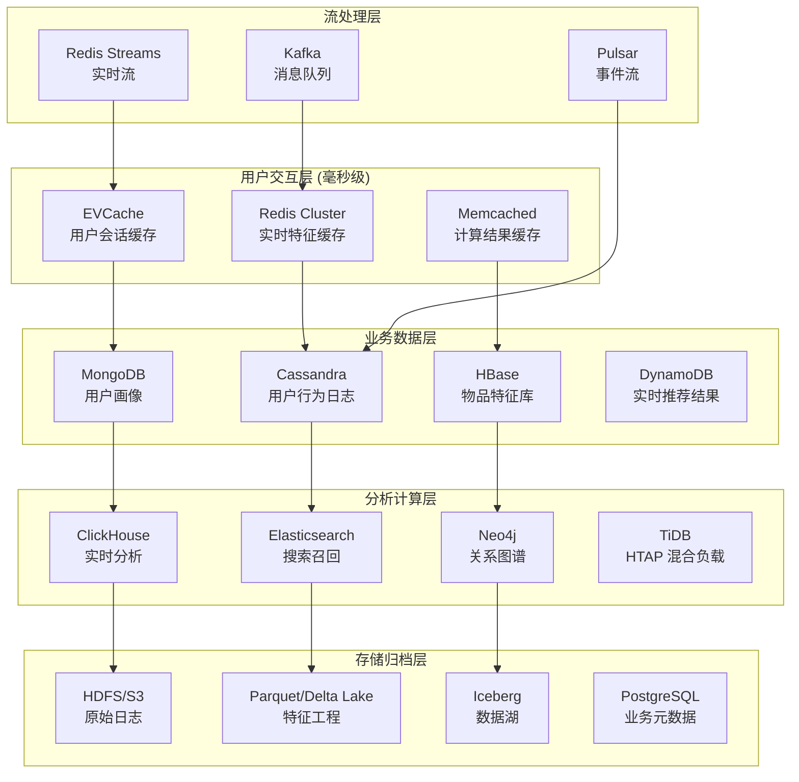

# 企业级推荐系统数据库架构设计

## 🎯 当前架构 vs 完整推荐系统架构

### 当前项目数据库 (基础版)
```
Redis (特征缓存) + SQLite (元数据) + Parquet (批处理)
```

### 完整推荐系统数据库架构 (企业级)


## 📊 数据分层存储策略

### 1. 热数据层 (Hot Tier) - 毫秒级访问
```yaml
# EVCache 配置
evcache:
  clusters:
    - name: "user-session"
      ttl: 1800  # 30分钟
      replicas: 3
      memory_size: "16GB"
      use_cases:
        - 用户会话状态
        - 实时推荐结果
        - 用户偏好缓存

# Redis Cluster 配置  
redis_cluster:
  nodes: 6
  memory_per_node: "32GB"
  persistence: "rdb"
  use_cases:
    - 实时特征向量
    - 用户行为计数器
    - 热门物品缓存
```

### 2. 温数据层 (Warm Tier) - 秒级访问
```yaml
# MongoDB 配置
mongodb:
  replica_set: "rs0"
  sharding: true
  collections:
    user_profiles:
      shard_key: "user_id"
      indexes: ["user_id", "created_at", "tags"]
    item_catalog:
      shard_key: "item_id" 
      indexes: ["category", "brand", "price_range"]

# Cassandra 配置
cassandra:
  keyspaces:
    user_behavior:
      replication_factor: 3
      tables:
        - user_clicks
        - user_purchases
        - user_ratings
        - user_views
```

### 3. 冷数据层 (Cold Tier) - 分钟级访问
```yaml
# ClickHouse 配置
clickhouse:
  clusters:
    - name: "analytics"
      shards: 4
      replicas: 2
      tables:
        user_behavior_agg:
          engine: "ReplacingMergeTree"
          partition_by: "toYYYYMM(event_date)"
          order_by: "(user_id, event_date)"

# Elasticsearch 配置
elasticsearch:
  indices:
    item_search:
      shards: 5
      replicas: 1
      mappings:
        title: {"type": "text", "analyzer": "ik_max_word"}
        category: {"type": "keyword"}
        embedding: {"type": "dense_vector", "dims": 768}
```

## 🏗️ 数据库选型原则

### 按数据类型分类

#### 1. 用户数据
```python
# 用户基础信息 - MongoDB
user_profile = {
    "user_id": "12345",
    "demographics": {
        "age": 28,
        "gender": "F",
        "location": "Chicago"
    },
    "preferences": {
        "categories": ["electronics", "books"],
        "brands": ["Apple", "Samsung"],
        "price_range": [100, 1000]
    },
    "behavior_summary": {
        "total_purchases": 45,
        "avg_order_value": 156.78,
        "last_active": "2024-01-15T10:30:00Z"
    }
}

# 用户行为序列 - Cassandra
user_behavior = {
    "user_id": "12345",
    "timestamp": "2024-01-15T10:30:00Z",
    "event_type": "click",
    "item_id": "item_789",
    "context": {
        "page": "homepage",
        "position": 3,
        "device": "mobile"
    }
}
```

#### 2. 物品数据
```python
# 物品特征 - HBase
item_features = {
    "row_key": "item_789",
    "basic_info": {
        "title": "iPhone 15 Pro",
        "category": "electronics",
        "brand": "Apple",
        "price": 999.99
    },
    "computed_features": {
        "popularity_score": 0.85,
        "quality_score": 0.92,
        "embedding": [0.1, 0.2, ..., 0.8]  # 768维向量
    },
    "stats": {
        "view_count": 15420,
        "purchase_count": 892,
        "rating_avg": 4.6
    }
}

# 物品搜索索引 - Elasticsearch
item_search_doc = {
    "item_id": "item_789",
    "title": "iPhone 15 Pro 256GB 深空黑色",
    "category": "手机",
    "brand": "Apple",
    "price": 999.99,
    "tags": ["5G", "Pro", "摄影"],
    "embedding": [0.1, 0.2, ..., 0.8],
    "popularity": 0.85
}
```

#### 3. 关系数据
```python
# 用户-物品关系图 - Neo4j
cypher_query = """
CREATE (u:User {user_id: '12345', age: 28})
CREATE (i:Item {item_id: 'item_789', category: 'electronics'})
CREATE (u)-[:PURCHASED {timestamp: '2024-01-15', rating: 5}]->(i)
CREATE (u)-[:SIMILAR_TO {similarity: 0.85}]->(u2:User {user_id: '67890'})
"""

# 协同过滤矩阵 - TiDB
user_item_matrix = """
CREATE TABLE user_item_interactions (
    user_id BIGINT,
    item_id BIGINT,
    interaction_type ENUM('view', 'click', 'purchase', 'rating'),
    score DECIMAL(3,2),
    timestamp TIMESTAMP,
    INDEX idx_user (user_id),
    INDEX idx_item (item_id),
    INDEX idx_time (timestamp)
) PARTITION BY RANGE (UNIX_TIMESTAMP(timestamp)) (
    PARTITION p202401 VALUES LESS THAN (UNIX_TIMESTAMP('2024-02-01')),
    PARTITION p202402 VALUES LESS THAN (UNIX_TIMESTAMP('2024-03-01'))
);
"""
```

## ⚡ 缓存策略设计

### 多级缓存架构
```python
class MultiLevelCache:
    """多级缓存管理器"""
    
    def __init__(self):
        # L1: EVCache (最热数据)
        self.l1_cache = EVCacheClient(
            app_name="recommendation",
            cache_prefix="rec_",
            ttl=300  # 5分钟
        )
        
        # L2: Redis (热数据)
        self.l2_cache = RedisCluster(
            nodes=[
                {"host": "redis-1", "port": 6379},
                {"host": "redis-2", "port": 6379},
                {"host": "redis-3", "port": 6379}
            ],
            ttl=3600  # 1小时
        )
        
        # L3: MongoDB (温数据)
        self.l3_cache = MongoClient(
            "mongodb://mongo-cluster:27017/recommendation"
        )
    
    async def get_user_recommendations(self, user_id: str) -> List[Dict]:
        """获取用户推荐 - 多级缓存策略"""
        
        # L1 缓存查找
        cache_key = f"user_rec_{user_id}"
        result = await self.l1_cache.get(cache_key)
        if result:
            return result
        
        # L2 缓存查找
        result = await self.l2_cache.get(cache_key)
        if result:
            # 回填 L1 缓存
            await self.l1_cache.set(cache_key, result, ttl=300)
            return result
        
        # L3 数据库查找
        result = await self.l3_cache.find_one(
            {"user_id": user_id}, 
            {"recommendations": 1}
        )
        
        if result:
            recommendations = result["recommendations"]
            # 回填多级缓存
            await self.l2_cache.set(cache_key, recommendations, ttl=3600)
            await self.l1_cache.set(cache_key, recommendations, ttl=300)
            return recommendations
        
        return []
```

## 🔄 数据流转架构

### 实时数据流
```python
# Kafka 消息生产者
class RecommendationEventProducer:
    """推荐系统事件生产者"""
    
    def __init__(self):
        self.producer = KafkaProducer(
            bootstrap_servers=['kafka-1:9092', 'kafka-2:9092'],
            value_serializer=lambda x: json.dumps(x).encode('utf-8')
        )
    
    async def send_user_behavior(self, event: Dict):
        """发送用户行为事件"""
        # 发送到不同主题
        topics = {
            'click': 'user-clicks',
            'purchase': 'user-purchases', 
            'view': 'user-views',
            'rating': 'user-ratings'
        }
        
        topic = topics.get(event['event_type'], 'user-behaviors')
        await self.producer.send(topic, value=event)
    
    async def send_model_update(self, model_metrics: Dict):
        """发送模型更新事件"""
        await self.producer.send('model-updates', value=model_metrics)

# 流处理消费者
class RecommendationStreamProcessor:
    """推荐系统流处理器"""
    
    def __init__(self):
        self.consumer = KafkaConsumer(
            'user-behaviors',
            bootstrap_servers=['kafka-1:9092'],
            group_id='recommendation-processor'
        )
        
        # 数据库连接
        self.cassandra = CassandraCluster(['cassandra-1', 'cassandra-2'])
        self.redis = RedisCluster(nodes=[...])
        self.mongodb = MongoClient("mongodb://mongo-cluster:27017")
    
    async def process_user_behavior(self, event: Dict):
        """处理用户行为事件"""
        user_id = event['user_id']
        item_id = event['item_id']
        
        # 1. 写入 Cassandra (用户行为日志)
        await self.cassandra.execute(
            "INSERT INTO user_behavior (user_id, item_id, event_type, timestamp) VALUES (?, ?, ?, ?)",
            [user_id, item_id, event['event_type'], event['timestamp']]
        )
        
        # 2. 更新 Redis (实时计数器)
        await self.redis.incr(f"item_views:{item_id}")
        await self.redis.incr(f"user_actions:{user_id}")
        
        # 3. 更新 MongoDB (用户画像)
        await self.mongodb.recommendation.user_profiles.update_one(
            {"user_id": user_id},
            {"$inc": {"behavior_stats.total_actions": 1}},
            upsert=True
        )
        
        # 4. 触发实时推荐更新
        await self.update_real_time_recommendations(user_id)
```

## 📈 性能优化策略

### 数据库性能对比
| 数据库 | 读延迟 | 写延迟 | 吞吐量 | 适用场景 |
|--------|--------|--------|--------|----------|
| **EVCache** | <1ms | <1ms | 1M+ QPS | 用户会话 |
| **Redis Cluster** | 1-5ms | 1-5ms | 500K QPS | 实时特征 |
| **MongoDB** | 5-20ms | 5-20ms | 100K QPS | 用户画像 |
| **Cassandra** | 10-50ms | 1-10ms | 1M+ WPS | 行为日志 |
| **ClickHouse** | 100ms-1s | 100ms-1s | 1B+ rows/s | 实时分析 |
| **Elasticsearch** | 10-100ms | 50-200ms | 50K QPS | 搜索召回 |

### 分片策略
```python
# 用户数据分片策略
def get_user_shard(user_id: str) -> str:
    """根据用户ID计算分片"""
    shard_count = 16
    shard_id = hash(user_id) % shard_count
    return f"user_shard_{shard_id:02d}"

# 物品数据分片策略  
def get_item_shard(item_id: str) -> str:
    """根据物品ID计算分片"""
    shard_count = 32
    shard_id = hash(item_id) % shard_count
    return f"item_shard_{shard_id:02d}"

# 时间分片策略
def get_time_partition(timestamp: datetime) -> str:
    """根据时间计算分区"""
    return f"p{timestamp.strftime('%Y%m')}"
```

## 🚀 部署架构

### Kubernetes 部署清单
```yaml
# evcache-deployment.yaml
apiVersion: apps/v1
kind: Deployment
metadata:
  name: evcache-cluster
spec:
  replicas: 3
  selector:
    matchLabels:
      app: evcache
  template:
    metadata:
      labels:
        app: evcache
    spec:
      containers:
      - name: evcache
        image: netflix/evcache:latest
        ports:
        - containerPort: 11211
        env:
        - name: CACHE_SIZE
          value: "16g"
        - name: MAX_CONNECTIONS
          value: "10000"
        resources:
          requests:
            memory: "18Gi"
            cpu: "4"
          limits:
            memory: "20Gi"
            cpu: "8"

---
# mongodb-cluster.yaml
apiVersion: apps/v1
kind: StatefulSet
metadata:
  name: mongodb-cluster
spec:
  serviceName: mongodb
  replicas: 3
  selector:
    matchLabels:
      app: mongodb
  template:
    metadata:
      labels:
        app: mongodb
    spec:
      containers:
      - name: mongodb
        image: mongo:6.0
        ports:
        - containerPort: 27017
        env:
        - name: MONGO_INITDB_ROOT_USERNAME
          value: "admin"
        - name: MONGO_INITDB_ROOT_PASSWORD
          valueFrom:
            secretKeyRef:
              name: mongodb-secret
              key: password
        volumeMounts:
        - name: mongodb-storage
          mountPath: /data/db
        resources:
          requests:
            memory: "8Gi"
            cpu: "2"
          limits:
            memory: "16Gi"
            cpu: "4"
  volumeClaimTemplates:
  - metadata:
      name: mongodb-storage
    spec:
      accessModes: ["ReadWriteOnce"]
      resources:
        requests:
          storage: 100Gi
```

## 💡 总结

完整的推荐系统数据库架构应该包含：

### 必需组件
1. **EVCache/Memcached** - 超低延迟缓存
2. **Redis Cluster** - 实时特征存储
3. **MongoDB/DynamoDB** - 用户画像存储
4. **Cassandra/HBase** - 大规模行为日志
5. **ClickHouse** - 实时分析OLAP
6. **Elasticsearch** - 搜索和召回
7. **Neo4j** - 关系图谱
8. **Kafka/Pulsar** - 实时数据流

### 当前项目可以扩展的方向
- 🚀 引入 EVCache 提升缓存性能
- 📊 添加 MongoDB 存储用户画像
- 🔍 集成 Elasticsearch 支持搜索召回
- 📈 部署 ClickHouse 进行实时分析
- 🕸️ 使用 Neo4j 构建关系图谱

这样的架构才能支撑**百万级用户、千万级物品**的企业级推荐系统！🎯
